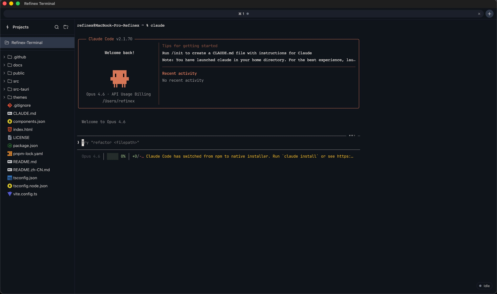

<div align="center">

# ⚡ Refinex Terminal

**A high-performance, AI-first terminal emulator built for Claude Code, Codex CLI, Copilot CLI and more.**
**Optimized for Apple Silicon (macOS ARM) and Windows.**

[](LICENSE)
[](https://www.rust-lang.org/)
[](https://tauri.app/)
[](https://react.dev/)
[]()



[中文](./README.zh-CN.md) · [Features](#-features) · [Architecture](#-architecture) · [Quick Start](#-quick-start) · [Configuration](#-configuration) · [Roadmap](#-roadmap) · [Contributing](#-contributing)

</div>

---

## 🎯 Why Refinex Terminal?

The rise of AI coding agents (Claude Code, Codex CLI, Gemini CLI, Copilot CLI) has fundamentally changed how developers work in the terminal. Yet existing terminals remain passive shells with no awareness of AI workflows. **Refinex Terminal bridges this gap** — purpose-built for the agentic development era.

### The Problem

- Traditional terminals treat AI CLI output as plain text — no structure, no interaction
- Long AI outputs (thousands of lines) cause scroll-back lag and viewport freeze
- No native way to manage multiple AI agents across different repositories simultaneously
- Git operations triggered by AI require constant context-switching to external tools
- No file tree or diff viewer integrated with the terminal for AI-generated changes

### The Solution

Refinex Terminal is **not another general-purpose terminal**. It is a specialized command center for AI-assisted development, providing first-class support for agent workflows, intelligent output handling, integrated Git, and a multi-project sidebar — all wrapped in a blazing-fast native shell.

---

## ✨ Features

### 🚀 Core Terminal Engine

- **Native performance** — Rust backend (via Tauri 2) with system WebView, no bundled Chromium
- **Sub-second launch** — cold start < 500ms on Apple Silicon, < 800ms on Windows
- **xterm.js rendering** with WebGL addon for GPU-accelerated terminal output
- **Full VT100/VT220/xterm-256color** escape sequence support
- **Unicode & emoji** support with ligature-capable font rendering
- **Scrollback buffer** — configurable up to 100,000 lines with virtualized rendering

### 🤖 AI-First Experience

- **Smart output blocks** — AI responses are grouped into collapsible, navigable blocks
- **Streaming-safe viewport** — zero-jank rendering during AI long-output (10,000+ lines)
- **One-click CLI setup** — built-in configuration wizard for Claude Code, Codex CLI, Copilot CLI, Gemini CLI
- **Agent status indicator** — real-time display of running agent state (thinking, writing, idle)
- **Prompt bookmarking** — save and recall frequently used AI prompts
- **Output search & filter** — regex-powered search within AI output blocks

### 📂 Multi-Project Sidebar

- **Repository navigator** — open multiple code repos in a sidebar tree
- **Per-repo terminal tabs** — each project gets its own isolated terminal session
- **File tree browser** — expand, click-to-preview, and edit files directly
- **AI change tracker** — highlights files modified by AI agents with diff indicators

### 🔀 Integrated Git

- **Native Git integration** — leverages locally installed `git` binary
- **Change overview panel** — staged/unstaged files with inline diff preview
- **One-click operations** — commit, push, pull, fetch, branch, stash from the UI
- **AI commit messages** — auto-generate commit messages from AI-produced diffs
- **Diff viewer** — side-by-side and inline diff for AI-modified files
- **Branch management** — visual branch switcher with merge/rebase support

### ⌨️ Keyboard-Driven Workflow

- **Command palette** — `Cmd/Ctrl + Shift + P` for all actions
- **Split panes** — horizontal/vertical splits with `Cmd/Ctrl + D` / `Cmd/Ctrl + Shift + D`
- **Tab management** — `Cmd/Ctrl + T` new tab, `Cmd/Ctrl + W` close, `Cmd/Ctrl + [1-9]` switch
- **Quick project switch** — `Cmd/Ctrl + Shift + O` to jump between repos
- **Fuzzy file finder** — `Cmd/Ctrl + P` to open any file from the active project
- **Fully customizable** — remap any keybinding via JSON configuration

### 🎨 Themes & Customization

- **Built-in themes** — ships with 20+ curated themes (dark & light)
- **Custom themes** — define themes via TOML configuration
- **Font control** — family, size, line height, letter spacing, ligature toggle
- **Opacity & blur** — window transparency with vibrancy/acrylic backdrop
- **Layout presets** — save and restore window layouts

### ⚡ Performance Optimizations

- **Virtualized scrollback** — only visible lines are in the DOM
- **Output throttling** — batched rendering at 60fps during high-throughput streams
- **Lazy file tree** — directories loaded on-demand, not upfront
- **Background process isolation** — each PTY runs in a separate Rust thread
- **Memory-mapped large files** — preview large files without loading into memory
- **Incremental search** — search indexes built progressively, no UI blocking

---

## 🏗 Architecture

```
┌─────────────────────────────────────────────────────┐
│                  Refinex Terminal                     │
│                                                       │
│  ┌─────────────────────────────────────────────────┐ │
│  │              Frontend (WebView)                  │ │
│  │  React 19 + TypeScript + Tailwind CSS v4        │ │
│  │  xterm.js + WebGL Addon + shadcn/ui             │ │
│  │  Zustand (state) + TanStack Query (async)       │ │
│  └──────────────────┬──────────────────────────────┘ │
│                     │ Tauri IPC (invoke/events)       │
│  ┌──────────────────▼──────────────────────────────┐ │
│  │              Backend (Rust / Tauri 2)            │ │
│  │  PTY Manager (portable-pty)                     │ │
│  │  Git Operations (git2-rs)                       │ │
│  │  File System Watcher (notify)                   │ │
│  │  Config Manager (toml + serde)                  │ │
│  │  CLI Registry & Process Manager                 │ │
│  └─────────────────────────────────────────────────┘ │
│                                                       │
│  ┌─────────────────────────────────────────────────┐ │
│  │              System Layer                        │ │
│  │  macOS: WebKit WebView + Metal GPU              │ │
│  │  Windows: WebView2 (Edge/Chromium)              │ │
│  │  PTY: /dev/ptmx (macOS) / ConPTY (Windows)     │ │
│  └─────────────────────────────────────────────────┘ │
└─────────────────────────────────────────────────────┘
```

### Technology Stack

| Layer                 | Technology                 | Rationale                                                         |
| --------------------- | -------------------------- | ----------------------------------------------------------------- |
| **Desktop Shell**     | Tauri 2.x                  | Native WebView, ~3MB binary, Rust backend, no Chromium bundle     |
| **Backend**           | Rust                       | Memory safety, thread-safe PTY management, native Git via git2    |
| **Frontend**          | React 19 + TypeScript 5.6  | Component model, ecosystem, developer familiarity                 |
| **Terminal Emulator** | xterm.js 5.x + WebGL addon | Industry standard (powers VS Code), GPU-accelerated rendering     |
| **PTY**               | portable-pty (Rust)        | Cross-platform pseudoterminal, avoids node-pty native compilation |
| **Styling**           | Tailwind CSS v4            | Utility-first, tree-shakable, zero-runtime                        |
| **UI Components**     | shadcn/ui + Radix          | Accessible, composable, copy-paste components                     |
| **Icons**             | Lucide React               | Consistent, tree-shakable, 1400+ icons                            |
| **State Management**  | Zustand                    | Minimal boilerplate, no Provider wrapper, performant selectors    |
| **Git**               | git2-rs                    | Rust bindings to libgit2, no shell-out overhead                   |
| **File Watching**     | notify (Rust)              | Cross-platform fs events with debouncing                          |
| **Config Format**     | TOML                       | Human-readable, Rust-native serde support                         |
| **Build**             | Vite 6                     | Fast HMR, optimized production builds                             |
| **Package Manager**   | pnpm                       | Efficient disk usage, strict dependency resolution                |

### Why Tauri over Electron?

| Metric           | Tauri 2                             | Electron                     |
| ---------------- | ----------------------------------- | ---------------------------- |
| Binary size      | ~3–10 MB                            | ~150 MB+                     |
| Memory (idle)    | ~30–50 MB                           | ~150–300 MB                  |
| Startup time     | < 500ms                             | 1–2s                         |
| Backend language | Rust (native perf)                  | Node.js (interpreted)        |
| Security model   | Capability-based, locked by default | Permissive, manual hardening |
| Bundled runtime  | None (uses system WebView)          | Full Chromium + Node.js      |

---

## 🚀 Quick Start

### Prerequisites

- **macOS**: macOS 12+ (Monterey) on Apple Silicon or Intel
- **Windows**: Windows 10 1809+ (WebView2 required)
- **Rust**: 1.82+ via [rustup](https://rustup.rs/)
- **Node.js**: 20 LTS+ via [fnm](https://github.com/Schniz/fnm) or nvm
- **pnpm**: 9+ (`corepack enable && corepack prepare pnpm@latest --activate`)
- **Git**: 2.40+ (must be in PATH)

> See [`docs/SETUP.md`](docs/SETUP.md) for detailed environment setup instructions.

### Build from Source

```bash
# Clone the repository
git clone https://github.com/refinex-lab/refinex-terminal.git
cd refinex-terminal

# Install frontend dependencies
pnpm install

# Run in development mode (hot-reload)
pnpm tauri dev

# Build production binary
pnpm tauri build
```

The production binary will be output to `src-tauri/target/release/bundle/`.

---

## ⚙️ Configuration

Refinex Terminal uses a layered TOML configuration system. The default config path:

- **macOS**: `~/Library/Application Support/com.refinex.terminal/config.toml`
- **Windows**: `%APPDATA%\com.refinex.terminal\config.toml`

### Example `config.toml`

```toml
[appearance]
theme = "refinex-dark"          # Built-in theme name or path to custom .toml theme
font_family = "JetBrains Mono"  # Any locally installed font
font_size = 14                  # In pixels
line_height = 1.4               # Multiplier
ligatures = true
cursor_style = "bar"            # "block" | "bar" | "underline"
cursor_blink = true
opacity = 0.95                  # 0.0 – 1.0 (1.0 = fully opaque)
vibrancy = true                 # macOS vibrancy / Windows acrylic

[terminal]
shell = "auto"                  # "auto" | "/bin/zsh" | "powershell.exe" | custom path
scrollback_lines = 50000
copy_on_select = true
word_separators = " \\t{}()[]'\""
bell = "visual"                 # "audio" | "visual" | "none"

[terminal.env]                  # Extra environment variables injected into every session
EDITOR = "code --wait"
LANG = "en_US.UTF-8"

[ai]
detect_cli = true               # Auto-detect Claude Code, Codex CLI, etc.
block_mode = true               # Group AI output into collapsible blocks
streaming_throttle_ms = 16      # Render batching interval (~60fps)
max_block_lines = 50000         # Max lines before auto-collapse

[git]
enabled = true
auto_fetch_interval = 300       # Seconds (0 = disabled)
show_diff_on_select = true
sign_commits = false

[keybindings]                   # Override any default keybinding
"Cmd+Shift+P" = "command_palette"
"Cmd+D" = "split_horizontal"
"Cmd+Shift+D" = "split_vertical"
"Cmd+T" = "new_tab"
"Cmd+W" = "close_tab"
"Cmd+Shift+O" = "quick_project_switch"
"Cmd+P" = "fuzzy_file_finder"

[projects]                      # Pinned project directories
paths = [
  "~/Code/my-app",
  "~/Code/backend-api",
]
```

### Custom Themes

Create a `.toml` file anywhere and reference it via `theme = "/path/to/my-theme.toml"`:

```toml
[colors]
background = "#1a1b26"
foreground = "#a9b1d6"
cursor = "#c0caf5"
selection = "#33467c"
black = "#15161e"
red = "#f7768e"
green = "#9ece6a"
yellow = "#e0af68"
blue = "#7aa2f7"
magenta = "#bb9af7"
cyan = "#7dcfff"
white = "#c0caf5"
```

---

## 📂 Project Structure

```
refinex-terminal/
├── CLAUDE.md                   # AI agent instructions (Claude Code)
├── README.md                   # This file
├── LICENSE                     # MIT License
├── CONTRIBUTING.md             # Contribution guidelines
├── package.json                # Frontend dependencies & scripts
├── pnpm-lock.yaml
├── tsconfig.json               # TypeScript configuration
├── vite.config.ts              # Vite build config
├── tailwind.config.ts          # Tailwind CSS v4 config
├── docs/
│   ├── PPLAN.md                # Phased implementation plan
│   ├── SETUP.md                # Environment setup guide
│   └── assets/                 # Documentation images
├── .github/
│   ├── COMMIT_CONVENTION.md    # Git commit standards
│   └── workflows/              # CI/CD pipelines
├── src/                        # Frontend source (React + TypeScript)
│   ├── main.tsx                # React entry point
│   ├── App.tsx                 # Root application component
│   ├── components/
│   │   ├── terminal/           # Terminal emulator components
│   │   ├── sidebar/            # Project navigator & file tree
│   │   ├── git/                # Git panel components
│   │   ├── tabs/               # Tab bar & management
│   │   ├── command-palette/    # Command palette overlay
│   │   └── ui/                 # shadcn/ui base components
│   ├── hooks/                  # Custom React hooks
│   ├── stores/                 # Zustand state stores
│   ├── lib/                    # Utility functions & Tauri IPC wrappers
│   ├── styles/                 # Global styles & Tailwind imports
│   └── types/                  # TypeScript type definitions
├── src-tauri/                  # Rust backend (Tauri 2)
│   ├── Cargo.toml              # Rust dependencies
│   ├── tauri.conf.json         # Tauri application config
│   ├── capabilities/           # Tauri permission capabilities
│   ├── src/
│   │   ├── main.rs             # Tauri entry point
│   │   ├── lib.rs              # Library root
│   │   ├── pty/                # PTY manager module
│   │   ├── git/                # Git operations module
│   │   ├── fs/                 # File system module
│   │   ├── config/             # Configuration module
│   │   ├── cli/                # AI CLI detection & management
│   │   └── commands/           # Tauri IPC command handlers
│   └── icons/                  # Application icons
└── themes/                     # Built-in theme TOML files
```

---

## 🗺 Roadmap

### v0.1.0 — Foundation (Milestone 1)

- [x] Project scaffolding (Tauri 2 + React 19 + TypeScript)
- [ ] Basic terminal emulation (xterm.js + PTY)
- [ ] Tab management (new, close, switch)
- [ ] Configurable appearance (font, theme, opacity)

### v0.2.0 — AI Integration (Milestone 2)

- [ ] AI output block detection & grouping
- [ ] Streaming-safe rendering pipeline
- [ ] CLI auto-detection (Claude Code, Codex, etc.)
- [ ] Agent status indicators

### v0.3.0 — Multi-Project & File System (Milestone 3)

- [ ] Sidebar project navigator
- [ ] File tree with click-to-open
- [ ] In-app file preview & basic editor
- [ ] Quick project switching

### v0.4.0 — Git Integration (Milestone 4)

- [ ] Git status panel (staged, unstaged, untracked)
- [ ] Inline diff viewer
- [ ] Commit, push, pull, fetch from UI
- [ ] AI-generated commit messages

### v0.5.0 — Polish & Performance (Milestone 5)

- [ ] Command palette
- [ ] Split panes
- [ ] Keybinding customization
- [ ] Performance profiling & optimization
- [ ] Accessibility audit

### v1.0.0 — Production Release

- [ ] Auto-updater
- [ ] Installer signing (macOS notarization, Windows code signing)
- [ ] User documentation site
- [ ] Plugin API (experimental)

---

## 🤝 Contributing

We welcome contributions of all kinds! Whether it's a bug report, a feature suggestion, a documentation improvement, or a code contribution — every bit helps.

Please read [CONTRIBUTING.md](CONTRIBUTING.md) before submitting a pull request.

---

## 📄 License

This project is licensed under the **MIT License** — see the [LICENSE](LICENSE) file for details.

---

<div align="center">

**If Refinex Terminal helps your AI-powered development workflow, please consider giving it a ⭐**

Made with ❤️ and 🦀 Rust · [refinex-lab](https://github.com/refinex-lab)

</div>
