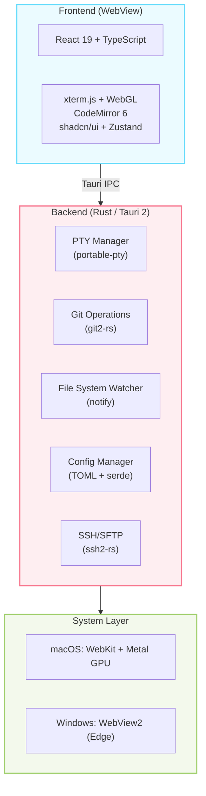

<div align="center">

# ⚡ Refinex Terminal

**An AI-first terminal emulator built for modern development workflows**

Optimized for Claude Code, GitHub Copilot CLI, Codex CLI, and Gemini CLI

[](LICENSE)
[](https://www.rust-lang.org/)
[](https://tauri.app/)
[](https://react.dev/)
[]()

[Features](#-features) · [Quick Start](#-quick-start) · [Documentation](#-documentation) · [Contributing](#-contributing)

</div>

---

## 🎯 Why Refinex Terminal?

The rise of AI coding assistants has fundamentally changed how developers work. **Refinex Terminal** is purpose-built for this new era — a specialized command center that seamlessly integrates with AI CLI tools while providing a powerful, modern terminal experience.

### What Makes It Different

- **AI CLI Integration**: First-class support for Claude Code, GitHub Copilot CLI, Codex CLI, and Gemini CLI
- **Project-Centric**: Multi-project sidebar with file tree, Git integration, and code editor
- **Native Performance**: Built with Rust and Tauri 2 — fast startup, low memory, small binary
- **Modern UX**: Command palette, split panes, fuzzy finder, and keyboard-driven workflow
- **Fully Customizable**: Themes, fonts, keybindings, and comprehensive configuration

---

## ✨ Features

### 🚀 Core Terminal

- **Full-featured terminal** powered by xterm.js with WebGL rendering
- **Multi-tab support** with drag-and-drop reordering
- **Split panes** (horizontal and vertical) for multi-terminal workflows
- **Terminal search** with regex support and match navigation
- **Copy/paste** with configurable copy-on-select
- **Scrollback buffer** with configurable line limit (up to 100,000 lines)
- **Shell detection** (zsh, bash, PowerShell, cmd) with environment variable management

### 🤖 AI CLI Integration

- **Automatic detection** of AI coding assistants:
  - [Claude Code](https://code.claude.com/) by Anthropic
  - [GitHub Copilot CLI](https://docs.github.com/en/copilot/github-copilot-in-the-cli)
  - [Codex CLI](https://github.com/openai/codex) by OpenAI
  - [Gemini CLI](https://github.com/google-gemini/gemini-cli) by Google
- **Setup wizard** with detection, configuration, and testing
- **Settings panels** for each AI CLI with full configuration support
- **Shell integration** for easy AI CLI access

### 📂 Project Management

- **Multi-project sidebar** with file tree navigation
- **File preview** with syntax highlighting (20+ languages)
- **Built-in code editor** powered by CodeMirror 6
- **File system watcher** for real-time updates
- **Fuzzy file finder** (Cmd/Ctrl + P)
- **Quick project switch** (Cmd/Ctrl + Shift + O)
- **Global search and replace** across project files

### 🔀 Git Integration

- **Git status panel** with staged/unstaged/untracked files
- **Diff viewer** with syntax highlighting (unified and split views)
- **Branch management** with create, switch, and delete
- **Commit workflow** with message editor
- **Git graph visualization** with commit history
- **Push/pull/fetch** operations
- **Stash management**

### 🔗 SSH Support

- **SSH connection manager** with saved hosts
- **SFTP file browser** with upload/download
- **Multiple SSH sessions** in tabs
- **SSH key management**
- **Connection testing** and diagnostics

### ⌨️ Keyboard-Driven Workflow

- **Command palette** (Cmd/Ctrl + Shift + P) for quick actions
- **Split panes**: Cmd/Ctrl + D (horizontal), Cmd/Ctrl + Shift + D (vertical)
- **Tab management**: Cmd/Ctrl + T (new), Cmd/Ctrl + W (close), Cmd/Ctrl + 1-9 (switch)
- **Quick project switch**: Cmd/Ctrl + Shift + O
- **Fuzzy file finder**: Cmd/Ctrl + P
- **Global search**: Cmd/Ctrl + Shift + F
- **Fully customizable** keybindings

### 🎨 Themes & Customization

- **5 built-in themes**:
  - Refinex Dark (default)
  - Refinex Light
  - Tokyo Night
  - Catppuccin Mocha
  - GitHub Dark
- **Custom themes** via TOML configuration
- **Font customization** with system font detection
- **Window opacity and vibrancy** (macOS) / acrylic (Windows)
- **TOML-based configuration** with hot-reload

### ⚡ Performance

- **60fps rendering** during terminal output
- **WebGL acceleration** for smooth scrolling
- **Lazy loading** for large file trees
- **Efficient PTY management** with Rust backend
- **Fast startup** (< 500ms on Apple Silicon)
- **Small binary** (~10-15 MB)
- **Low memory** (~30-50 MB idle)

---

## 🏗 Architecture



### Technology Stack

| Layer                 | Technology                 | Why                                                               |
| --------------------- | -------------------------- | ----------------------------------------------------------------- |
| **Desktop Shell**     | Tauri 2.x                  | Native WebView, small binary, Rust backend, no Chromium bundle    |
| **Backend**           | Rust                       | Memory safety, performance, native Git via git2-rs                |
| **Frontend**          | React 19 + TypeScript 5.6  | Modern UI framework with strong typing                            |
| **Terminal Emulator** | xterm.js 5.x + WebGL       | Industry standard (powers VS Code), GPU-accelerated               |
| **Code Editor**       | CodeMirror 6               | Extensible, performant, modern code editing                       |
| **PTY**               | portable-pty               | Cross-platform pseudoterminal in Rust                             |
| **Styling**           | Tailwind CSS v4            | Utility-first, zero-runtime                                       |
| **UI Components**     | shadcn/ui + Radix          | Accessible, composable components                                 |
| **State Management**  | Zustand                    | Minimal boilerplate, performant                                   |
| **Git**               | git2-rs                    | Rust bindings to libgit2                                          |
| **SSH**               | ssh2-rs                    | Native SSH/SFTP support                                           |
| **Config Format**     | TOML                       | Human-readable, Rust-native                                       |
| **Build**             | Vite 6                     | Fast HMR, optimized builds                                        |
| **Package Manager**   | pnpm 9                     | Efficient, strict dependency resolution                           |

---

## 🚀 Quick Start

### Download Pre-built Binaries

**Coming soon!** Pre-built binaries will be available on the [Releases](https://github.com/refinex/refinex-terminal/releases) page.

### Build from Source

#### Prerequisites

- **macOS**: macOS 10.15+ (Catalina) on Apple Silicon or Intel
- **Windows**: Windows 10 1809+ (WebView2 required)
- **Rust**: 1.82+ via [rustup](https://rustup.rs/)
- **Node.js**: 20 LTS+ via [fnm](https://github.com/Schniz/fnm) or nvm
- **pnpm**: 9+ (`corepack enable && corepack prepare pnpm@latest --activate`)

> See [`docs/SETUP.md`](docs/SETUP.md) for detailed environment setup instructions.

#### Build Steps

```bash
# Clone the repository
git clone https://github.com/refinex/refinex-terminal.git
cd refinex-terminal

# Install frontend dependencies
pnpm install

# Run in development mode (hot-reload)
pnpm tauri dev

# Build production binary
pnpm tauri build
```

**Output locations**:
- macOS: `src-tauri/target/release/bundle/dmg/*.dmg`
- Windows: `src-tauri/target/release/bundle/nsis/*.exe`

---

## ⚙️ Configuration

Refinex Terminal uses a TOML configuration file located at:

- **macOS**: `~/.refinex/config.toml`
- **Windows**: `%USERPROFILE%\.refinex\config.toml`

### Example Configuration

```toml
[appearance]
theme = "refinex-dark"
font_family = "JetBrains Mono"
font_size = 14
line_height = 1.4
ligatures = true
cursor_style = "bar"
cursor_blink = true
opacity = 0.95
vibrancy = true

[terminal]
shell = "auto"
scrollback_lines = 50000
copy_on_select = true
bell = "visual"

[terminal.env]
EDITOR = "code --wait"
LANG = "en_US.UTF-8"

[ai]
detect_cli = true

[git]
enabled = true
auto_fetch_interval = 300
show_diff_on_select = true

[keybindings]
"Cmd+Shift+P" = "command_palette"
"Cmd+D" = "split_horizontal"
"Cmd+Shift+D" = "split_vertical"
"Cmd+T" = "new_tab"
"Cmd+W" = "close_tab"
"Cmd+P" = "fuzzy_file_finder"

[projects]
paths = [
  "~/Code/my-app",
  "~/Code/backend-api",
]
```

### Custom Themes

Create a `.toml` file with your color scheme:

```toml
name = "My Custom Theme"

[terminal]
background = "#1a1b26"
foreground = "#a9b1d6"
cursor = "#c0caf5"
selection = "#33467c"
black = "#15161e"
red = "#f7768e"
green = "#9ece6a"
yellow = "#e0af68"
blue = "#7aa2f7"
magenta = "#bb9af7"
cyan = "#7dcfff"
white = "#c0caf5"
# ... (bright colors)

[ui]
background = "#1a1b26"
foreground = "#a9b1d6"
border = "#292e42"
# ... (other UI colors)
```

Then reference it in your config: `theme = "/path/to/my-theme.toml"`

---

## 📚 Documentation

- **[Setup Guide](docs/SETUP.md)** - Detailed environment setup instructions
- **[Auto-Updater](docs/AUTO_UPDATER.md)** - Configure automatic updates
- **[macOS Signing](docs/MACOS_SIGNING.md)** - Code signing and notarization guide
- **[Windows Installer](docs/WINDOWS_INSTALLER.md)** - Windows installer configuration
- **[Changelog](CHANGELOG.md)** - Version history and release notes
- **[Contributing](CONTRIBUTING.md)** - Contribution guidelines

---

## 📂 Project Structure

```
refinex-terminal/
├── src/                        # Frontend (React + TypeScript)
│   ├── components/
│   │   ├── terminal/           # Terminal emulator
│   │   ├── sidebar/            # File tree & project navigation
│   │   ├── git/                # Git integration UI
│   │   ├── settings/           # Settings panels
│   │   ├── tabs/               # Tab management
│   │   └── ui/                 # shadcn/ui components
│   ├── hooks/                  # Custom React hooks
│   ├── stores/                 # Zustand state stores
│   ├── lib/                    # Utilities & Tauri IPC
│   └── types/                  # TypeScript types
├── src-tauri/                  # Backend (Rust + Tauri)
│   ├── src/
│   │   ├── pty/                # PTY management
│   │   ├── git/                # Git operations
│   │   ├── fs/                 # File system
│   │   ├── config/             # Configuration
│   │   ├── cli/                # AI CLI detection
│   │   ├── ssh/                # SSH/SFTP
│   │   └── commands/           # Tauri commands
│   └── icons/                  # App icons
├── themes/                     # Built-in themes
├── docs/                       # Documentation
└── .github/                    # CI/CD & templates
```

---

## 🗺 Roadmap

### ✅ v0.1.0 - Initial Release (Current)

- Core terminal emulation with xterm.js
- Multi-tab and split pane support
- AI CLI integration (Claude Code, Copilot CLI, Codex CLI, Gemini CLI)
- Project sidebar with file tree
- Git integration with diff viewer
- SSH/SFTP support
- Command palette and keyboard shortcuts
- 5 built-in themes
- Auto-updater
- macOS and Windows installers

### 🔮 Future Plans

- **AI Output Enhancement**
  - Smart output block detection and grouping
  - Agent status indicators (thinking, writing, waiting)
  - Streaming output optimization
- **Performance**
  - File tree virtualization for large projects
  - Memory optimization for long-running sessions
- **Features**
  - Custom theme editor
  - Plugin system
  - Session persistence
  - Terminal recording and playback
- **Platforms**
  - Linux support (Ubuntu, Fedora, Arch)
  - Portable mode (no installation)

---

## 🤝 Contributing

We welcome contributions! Whether it's:

- 🐛 Bug reports
- 💡 Feature suggestions
- 📖 Documentation improvements
- 🔧 Code contributions

Please read [CONTRIBUTING.md](CONTRIBUTING.md) for guidelines.

### Development

```bash
# Install dependencies
pnpm install

# Run with hot-reload
pnpm tauri dev

# Type check
pnpm tsc --noEmit

# Lint Rust code
cd src-tauri && cargo clippy -- -D warnings

# Build production
pnpm tauri build
```

---

## 📄 License

This project is licensed under the **MIT License** — see the [LICENSE](LICENSE) file for details.

---

## 🙏 Acknowledgments

Built with amazing open-source projects:

- [Tauri](https://tauri.app/) - Desktop app framework
- [xterm.js](https://xtermjs.org/) - Terminal emulator
- [React](https://react.dev/) - UI framework
- [Tailwind CSS](https://tailwindcss.com/) - Styling
- [shadcn/ui](https://ui.shadcn.com/) - UI components
- [CodeMirror](https://codemirror.net/) - Code editor
- [Zustand](https://zustand-demo.pmnd.rs/) - State management

---

<div align="center">

**If Refinex Terminal improves your development workflow, please give it a ⭐**

Made with ❤️ and 🦀 Rust

[GitHub](https://github.com/refinex/refinex-terminal) · [Issues](https://github.com/refinex/refinex-terminal/issues) · [Discussions](https://github.com/refinex/refinex-terminal/discussions)

</div>
