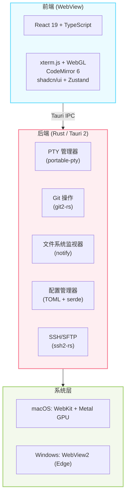

<div align="center">

# ⚡ Refinex Terminal

**专为现代开发工作流打造的 AI 优先终端模拟器**

针对 Claude Code、GitHub Copilot CLI、Codex CLI 和 Gemini CLI 优化

[](LICENSE)
[](https://www.rust-lang.org/)
[](https://tauri.app/)
[](https://react.dev/)
[]()

[English](README.md) · [中文](README.zh-CN.md)

[功能特性](#-功能特性) · [快速开始](#-快速开始) · [文档](#-文档) · [参与贡献](#-参与贡献)

</div>

---

## 🎯 为什么选择 Refinex Terminal？

AI 编程助手的兴起从根本上改变了开发者的工作方式。**Refinex Terminal** 正是为这个新时代而生 —— 一个专门的命令中心，与 AI CLI 工具无缝集成，同时提供强大、现代的终端体验。

### 与众不同之处

- **AI CLI 集成**：对 Claude Code、GitHub Copilot CLI、Codex CLI 和 Gemini CLI 的一流支持
- **项目为中心**：多项目侧边栏，包含文件树、Git 集成和代码编辑器
- **原生性能**：基于 Rust 和 Tauri 2 构建 —— 快速启动、低内存占用、小体积二进制
- **现代用户体验**：命令面板、分屏、模糊查找和键盘驱动的工作流
- **完全可定制**：主题、字体、快捷键和全面的配置

---

## ✨ 功能特性

### 🚀 核心终端

- **全功能终端**，由 xterm.js 驱动，支持 WebGL 渲染
- **多标签页支持**，可拖放重新排序
- **分屏**（水平和垂直），支持多终端工作流
- **终端搜索**，支持正则表达式和匹配导航
- **复制/粘贴**，可配置选中即复制
- **滚动缓冲区**，可配置行数限制（最多 100,000 行）
- **Shell 检测**（zsh、bash、PowerShell、cmd），支持环境变量管理

### 🤖 AI CLI 集成

- **自动检测** AI 编程助手：
  - [Claude Code](https://code.claude.com/) by Anthropic
  - [GitHub Copilot CLI](https://docs.github.com/en/copilot/github-copilot-in-the-cli)
  - [Codex CLI](https://github.com/openai/codex) by OpenAI
  - [Gemini CLI](https://github.com/google-gemini/gem-cli) by Google
- **设置向导**，包含检测、配置和测试
- **设置面板**，为每个 AI CLI 提供完整配置支持
- **Shell 集成**，方便访问 AI CLI

### 📂 项目管理

- **多项目侧边栏**，带文件树导航
- **文件预览**，支持语法高亮（20+ 种语言）
- **内置代码编辑器**，由 CodeMirror 6 驱动
- **文件系统监视器**，实时更新
- **模糊文件查找器**（Cmd/Ctrl + P）
- **快速项目切换**（Cmd/Ctrl + Shift + O）
- **全局搜索和替换**，跨项目文件

### 🔀 Git 集成

- **Git 状态面板**，显示已暂存/未暂存/未跟踪文件
- **差异查看器**，支持语法高亮（统一视图和分屏视图）
- **分支管理**，支持创建、切换和删除
- **提交工作流**，带消息编辑器
- **Git 图形可视化**，显示提交历史
- **推送/拉取/获取**操作
- **暂存管理**

### 🔗 SSH 支持

- **SSH 连接管理器**，可保存主机
- **SFTP 文件浏览器**，支持上传/下载
- **多个 SSH 会话**，在标签页中
- **SSH 密钥管理**
- **连接测试**和诊断

### ⌨️ 键盘驱动工作流

- **命令面板**（Cmd/Ctrl + Shift + P）快速操作
- **分屏**：Cmd/Ctrl + D（水平），Cmd/Ctrl + Shift + D（垂直）
- **标签页管理**：Cmd/Ctrl + T（新建），Cmd/Ctrl + W（关闭），Cmd/Ctrl + 1-9（切换）
- **快速项目切换**：Cmd/Ctrl + Shift + O
- **模糊文件查找器**：Cmd/Ctrl + P
- **全局搜索**：Cmd/Ctrl + Shift + F
- **完全可定制**的快捷键

### 🎨 主题与自定义

- **5 个内置主题**：
  - Refinex Dark（默认）
  - Refinex Light
  - Tokyo Night
  - Catppuccin Mocha
  - GitHub Dark
- **自定义主题**，通过 TOML 配置
- **字体自定义**，支持系统字体检测
- **窗口透明度和毛玻璃效果**（macOS）/ 亚克力效果（Windows）
- **基于 TOML 的配置**，支持热重载

### ⚡ 性能

- **60fps 渲染**，在终端输出期间
- **WebGL 加速**，流畅滚动
- **懒加载**，用于大型文件树
- **高效的 PTY 管理**，使用 Rust 后端
- **快速启动**（Apple Silicon 上 < 500ms）
- **小体积二进制**（~10-15 MB）
- **低内存占用**（空闲时 ~30-50 MB）

---

## 🏗 架构



### 技术栈

| 层级                 | 技术                       | 选型理由                                                      |
| -------------------| -------------------------- | ------------------------------------------------------------- |
| **桌面框架**         | Tauri 2.x                  | 原生 WebView，小体积二进制，Rust 后端，无需捆绑 Chromium     |
| **后端**             | Rust                       | 内存安全，性能优异，通过 git2-rs 原生支持 Git                |
| **前端**             | React 19 + TypeScript 5.6  | 现代 UI 框架，强类型支持                                      |
| **终端模拟器**       | xterm.js 5.x + WebGL       | 行业标准（VS Code 同款），GPU 加速                            |
| **代码编辑器**       | CodeMirror 6               | 可扩展，高性能，现代代码编辑                                  |
| **PTY**              | portable-pty               | Rust 跨平台伪终端                                             |
| **样式**             | Tailwind CSS v4            | 原子化，零运行时                                              |
| **UI 组件**          | shadcn/ui + Radix          | 可访问，可组合的组件                                          |
| **状态管理**         | Zustand                    | 极简样板代码，高性能                                          |
| **Git**              | git2-rs                    | libgit2 的 Rust 绑定                                          |
| **SSH**              | ssh2-rs                    | 原生 SSH/SFTP 支持                                            |
| **配置格式**         | TOML                       | 人类可读，Rust 原生支持                                       |
| **构建工具**         | Vite 6                     | 快速 HMR，优化构建                                            |
| **包管理器**         | pnpm 9                     | 高效，严格的依赖解析                                          |

---

## 🚀 快速开始

### 下载预构建二进制

**即将推出！** 预构建二进制将在 [Releases](https://github.com/refinex/refinex-terminal/releases) 页面提供。

### 从源码构建

#### 环境要求

- **macOS**：macOS 10.15+（Catalina），支持 Apple Silicon 或 Intel
- **Windows**：Windows 10 1809+（需要 WebView2）
- **Rust**：1.82+，通过 [rustup](https://rustup.rs/) 安装
- **Node.js**：20 LTS+，通过 [fnm](https://github.com/Schniz/fnm) 或 nvm 安装
- **pnpm**：9+（`corepack enable && corepack prepare pnpm@latest --activate`）

> 详细环境配置请参阅 [`docs/SETUP.md`](docs/SETUP.md)。

#### 构建步骤

```bash
# 克隆仓库
git clone https://github.com/refinex/refinex-terminal.git
cd refinex-terminal

# 安装前端依赖
pnpm install

# 开发模式运行（热重载）
pnpm tauri dev

# 构建生产版本
pnpm tauri build
```

**输出位置**：
- macOS：`src-tauri/target/release/bundle/dmg/*.dmg`
- Windows：`src-tauri/target/release/bundle/nsis/*.exe`

---

## ⚙️ 配置

Refinex Terminal 使用 TOML 配置文件，位于：

- **macOS**：`~/.refinex/config.toml`
- **Windows**：`%USERPROFILE%\.refinex\config.toml`

### 配置示例

```toml
[appearance]
theme = "refinex-dark"
font_family = "JetBrains Mono"
font_size = 14
line_height = 1.4
ligatures = true
cursor_style = "bar"
cursor_blink = true
opacity = 0.95
vibrancy = true

[terminal]
shell = "auto"
scrollback_lines = 50000
copy_on_select = true
bell = "visual"

[terminal.env]
EDITOR = "code --wait"
LANG = "en_US.UTF-8"

[ai]
detect_cli = true

[git]
enabled = true
auto_fetch_interval = 300
show_diff_on_select = true

[keybindings]
"Cmd+Shift+P" = "command_palette"
"Cmd+D" = "split_horizontal"
"Cmd+Shift+D" = "split_vertical"
"Cmd+T" = "new_tab"
"Cmd+W" = "close_tab"
"Cmd+P" = "fuzzy_file_finder"

[projects]
paths = [
  "~/Code/my-app",
  "~/Code/backend-api",
]
```

### 自定义主题

创建 `.toml` 文件定义您的配色方案：

```toml
name = "My Custom Theme"

[terminal]
background = "#1a1b26"
foreground = "#a9b1d6"
cursor = "#c0caf5"
selection = "#33467c"
black = "#15161e"
red = "#f7768e"
green = "#9ece6a"
yellow = "#e0af68"
blue = "#7aa2f7"
magenta = "#bb9af7"
cyan = "#7dcfff"
white = "#c0caf5"
# ... (亮色)

[ui]
background = "#1a1b26"
foreground = "#a9b1d6"
border = "#292e42"
# ... (其他 UI 颜色)
```

然后在配置中引用：`theme = "/path/to/my-theme.toml"`

---

## 📚 文档

- **[环境配置指南](docs/SETUP.md)** - 详细的环境配置说明
- **[自动更新器](docs/AUTO_UPDATER.zh-CN.md)** ([English](docs/AUTO_UPDATER.md)) - 配置自动更新
- **[macOS 签名](docs/MACOS_SIGNING.zh-CN.md)** ([English](docs/MACOS_SIGNING.md)) - 代码签名和公证指南
- **[Windows 安装程序](docs/WINDOWS_INSTALLER.zh-CN.md)** ([English](docs/WINDOWS_INSTALLER.md)) - Windows 安装程序配置
- **[更新日志](CHANGELOG.md)** - 版本历史和发布说明
- **[贡献指南](CONTRIBUTING.md)** - 贡献指南

---

## 📂 项目结构

```
refinex-terminal/
├── src/                        # 前端（React + TypeScript）
│   ├── components/
│   │   ├── terminal/           # 终端模拟器
│   │   ├── sidebar/            # 文件树和项目导航
│   │   ├── git/                # Git 集成 UI
│   │   ├── settings/           # 设置面板
│   │   ├── tabs/               # 标签页管理
│   │   └── ui/                 # shadcn/ui 组件
│   ├── hooks/                  # 自定义 React hooks
│   ├── stores/                 # Zustand 状态存储
│   ├── lib/                    # 工具函数和 Tauri IPC
│   └── types/                  # TypeScript 类型
├── src-tauri/                  # 后端（Rust + Tauri）
│   ├── src/
│   │   ├── pty/                # PTY 管理
│   │   ├── git/                # Git 操作
│   │   ├── fs/                 # 文件系统
│   │   ├── config/             # 配置
│   │   ├── cli/                # AI CLI 检测
│   │   ├── ssh/                # SSH/SFTP
│   │   └── commands/           # Tauri 命令
│   └── icons/                  # 应用图标
├── themes/                     # 内置主题
├── docs/                       # 文档
└── .github/                    # CI/CD 和模板
```

---

## 🗺 开发路线图

### ✅ v0.1.0 - 初始版本（当前）

- 基于 xterm.js 的核心终端模拟
- 多标签页和分屏支持
- AI CLI 集成（Claude Code、Copilot CLI、Codex CLI、Gemini CLI）
- 带文件树的项目侧边栏
- Git 集成和差异查看器
- SSH/SFTP 支持
- 命令面板和快捷键
- 5 个内置主题
- 自动更新器
- macOS 和 Windows 安装程序

### 🔮 未来计划

- **AI 输出增强**
  - 智能输出块检测和分组
  - 代理状态指示器（思考中、写入中、等待中）
  - 流式输出优化
- **性能**
  - 大型项目的文件树虚拟化
  - 长时间运行会话的内存优化
- **功能**
  - 自定义主题编辑器
  - 插件系统
  - 会话持久化
  - 终端录制和回放
- **平台**
  - Linux 支持（Ubuntu、Fedora、Arch）
  - 便携模式（无需安装）

---

## 🤝 参与贡献

我们欢迎各种形式的贡献！无论是：

- 🐛 Bug 报告
- 💡 功能建议
- 📖 文档改进
- 🔧 代码贡献

请阅读 [CONTRIBUTING.md](CONTRIBUTING.md) 了解指南。

### 开发

```bash
# 安装依赖
pnpm install

# 热重载运行
pnpm tauri dev

# 类型检查
pnpm tsc --noEmit

# Rust 代码检查
cd src-tauri && cargo clippy -- -D warnings

# 构建生产版本
pnpm tauri build
```

---

## 📄 许可证

本项目采用 **MIT 许可证** —— 详情参见 [LICENSE](LICENSE) 文件。

---

## 🙏 致谢

基于优秀的开源项目构建：

- [Tauri](https://tauri.app/) - 桌面应用框架
- [xterm.js](https://xtermjs.org/) - 终端模拟器
- [React](https://react.dev/) - UI 框架
- [Tailwind CSS](https://tailwindcss.com/) - 样式
- [shadcn/ui](https://ui.shadcn.com/) - UI 组件
- [CodeMirror](https://codemirror.net/) - 代码编辑器
- [Zustand](https://zustand-demo.pmnd.rs/) - 状态管理

---

<div align="center">

**如果 Refinex Terminal 改善了您的开发工作流，请给它一个 ⭐**

用 ❤️ 和 🦀 Rust 打造

[GitHub](https://github.com/refinex/refinex-terminal) · [Issues](https://github.com/refinex/refinex-terminal/issues) · [Discussions](https://github.com/refinex/refinex-terminal/discussions)

</div>
